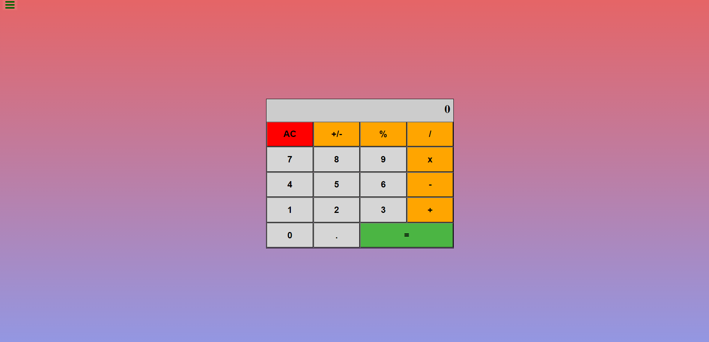

# Calculator

> This is a basic calculator.

## :red_circle: Live Demo:

[Live Demo Link](https://kcotrinam.github.io/fcc-calculator/)

## :hammer: Built with

- HTML5
- CSS3
- SCSS
- React
- VS code

## :construction_worker: Getting Started

To get a local copy up and running follow these simple steps:

1. Go to the [repository page](https://github.com/kcotrinam/fcc-calculator/).
2. Press the "Code" button and copy the link.
3. Clone it using git command `git clone <link>`.

## :bust_in_silhouette: Author

👤 **Kenvin Cotrina**

- GitHub: [kcotrinam](https://github.com/kcotrinam)
- Twitter: [@kcotrinam_dev](https://twitter.com/kcotrinam_dev)
- LinkedIn: [KevinCotrina](https://www.linkedin.com/in/kevincotrina/)

## 🤝 :raised_hand: :raised_hand: Contributions

Contributions, issues, and feature requests are welcome!

Feel free to check the [issues page](https://github.com/kcotrinam/fcc-calculator/issues).

## :muscle: Show your support

Give a ⭐️ if you like this project!

## :grey_exclamation: Acknowledgment

- [Stack Overflow](https://en.stackoverflow.com/)
- [Free Code Camp](https://www.freecodecamp.org/)

## 📝 License

This project is [MIT](LICENSE) licensed.
